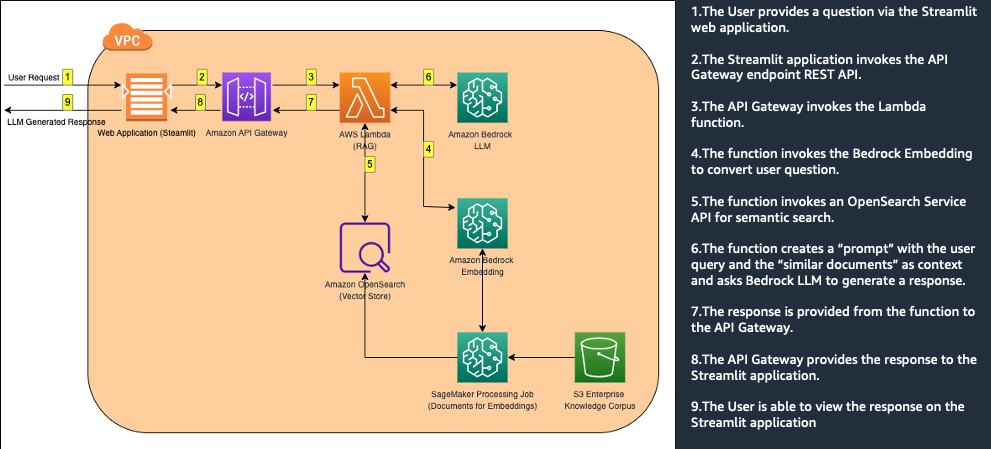

# QnA with Bedrock and RAG using Langchain

Use case : Build a QnA bot for an Enterprise customer using RAG and AWS Bedrock with Amazon OpenSearch as the vector store.

Use case description :
*Build a highly accurate QnA bot for Enterprise customers using Amazon Bedrock and RAG(Retrieval Augmented Generation) with Amazon OpenSearch as the vector store.
*Improve search results - Using OpenSearch k-NN search, by providing more relevant and accurate results to the users.
*Users can use natural language queries to find the information they are looking for.
*Reinvent User Experience using Generative AI and domain data to unlock insights
*Build an accurate and scalable Enterprise Search Engine with GenAI
*Ingest different document formats commonly used by Enterprise customers like pdfs, MS Word, html files etc. to aid Retrieval Augmented Generation.

## Solution Architecture



## Repository structure

This repository provides the source code for Large Language Model (LLM) based application that uses Retrieval Augmented Generation ( RAG ) with AWS Bedrock Titan model and AWS OpenSearch to provide relevant and accurate results to the users.

The code in this repo is organized into the following sub-folders, each having its own README.md file.

```.
├── README.md
├── cloudformation/
├── opensearch-data-ingestion/
├── rag/api
├── rag/app
├── rag/utilities
```

## Steps to deploy the solution.

### Clone the repo

```
git clone https://github.com/satveerkhurpa/llm-rag-hackathon.git
cd llm-rag-hackathon/rag/api
```

### Package the RAG endpoint as a docker container.

```
export AWS_REGION="us-west-2"
export AWS_ACCOUNT_ID=$(aws sts get-caller-identity --output text --query Account)

aws ecr create-repository \
--repository-name lambda-rag-api \
--image-scanning-configuration scanOnPush=true \
--region ${AWS_REGION}

aws ecr get-login-password --region ${AWS_REGION} | docker login --username AWS --password-stdin $AWS_ACCOUNT_ID.dkr.ecr.$AWS_REGION.amazonaws.com
docker build -t lambda-rag-api .
docker tag lambda-rag-api:latest $AWS_ACCOUNT_ID.dkr.ecr.$AWS_REGION.amazonaws.com/lambda-rag-api:latest
docker push $AWS_ACCOUNT_ID.dkr.ecr.$AWS_REGION.amazonaws.com/lambda-rag-api:latest
export CONTAINER_IMAGE_URI=$AWS_ACCOUNT_ID.dkr.ecr.$AWS_REGION.amazonaws.com/lambda-rag-api:latest
```

### Configure the Cloudformation stack.

Update the values for the following parameters.
Important : Update the value for the parameter *OpenSearchPassword*
```
export OpenSearchUsername="opensearchuser"
export OpenSearchPassword="<<Enter a password as per Opensearch requirements>"
export AppName="llm-rag-hackathon"
export OpenSearchIndexName="llm-rag-hackathon"
export LambdaFunctionName="LLMRagapp"
export APIGatewayName="LLMRagAPIGW"
export SageMakerNotebookName="aws-llm-rag-hackathon"
export BedrockEndPointUrl="https://prod.us-west-2.frontend.bedrock.aws.dev"
export BedRockRegion=$AWS_REGION
```

### Deploy the Cloudformation stack.
The cloudformation template will create a SageMaker Notebook called `aws-llm-rag-hackathon`, an IAM role for the SageMaker Notebook instance, deploy the RAG endpoint as a Lambda container along with an execution role and expose the lambda endpoint using an API gateway endpoint via a proxy.

```
cd ../../cloudformation
aws cloudformation deploy --template-file template.yml --stack-name $AppName \
     --parameter-overrides ContainerImageURI=$CONTAINER_IMAGE_URI \
      BedRockRegion=$BedRockRegion \
      BedrockEndPointUrl=$BedrockEndPointUrl \
      OpenSearchUsername=$OpenSearchUsername \
      OpenSearchPassword=$OpenSearchPassword \
      OpenSearchIndexName=$OpenSearchIndexName \
      LambdaFunctionName=$LambdaFunctionName \
      APIGatewayName=$APIGatewayName \
      SageMakerNotebookName=$SageMakerNotebookName \
     --capabilities CAPABILITY_NAMED_IAM --no-fail-on-empty-changeset
```

### Configure OpenSearch access for SageMaker and the Lambda function.
```
export SageMakerIAMRole=$(aws cloudformation describe-stacks --stack-name $AppName --query "Stacks[0].Outputs[?OutputKey=='SageMakerIAMRole'].OutputValue" --output text)
#echo $SageMakerIAMRole

export LambdaIAMRole=$(aws cloudformation describe-stacks --stack-name $AppName --query "Stacks[0].Outputs[?OutputKey=='LambdaIAMRole'].OutputValue" --output text)
#echo $LambdaIAMRole

export OS_ENDPOINT=$(aws cloudformation describe-stacks --stack-name $AppName --query "Stacks[0].Outputs[?OutputKey=='OpenSearchDomainEndpoint'].OutputValue" --output text)
$echo $OS_ENDPOINT

# Update the Opensearch internal database
curl -sS -u "${OpenSearchUsername}:${OpenSearchPassword}" -XPUT "https://${OS_ENDPOINT}/_plugins/_security/api/rolesmapping/all_access" -H 'Content-Type: application/json' -d'
{
  "backend_roles" : [ "'${SageMakerIAMRole}'","'${LambdaIAMRole}'" ],
  "users" : [ "opensearchuser" ]
}'
```

### Installation
1. Once the cloudformation stack has been created successfully, open the Outputs tab of the stack and note the URL for the API Gateway endpoint. (Key : LLMAppAPIEndpoint). We will be needing it to run a RAG query later on.

2. Open the `aws-llm-rag-hackathon` SageMaker Notebook created by the cloudformation template and then find the `qa_bedrock.ipynb` file and double click on it.

3. Do a `Run All` for this notebook OR execute each cell one by one and review results. It will ingest the documents as embeddings into the OpenSearch cluster and once that is done, we are not ready to ask some questions via the `/llm` endpoint of the Lambda function

4. Query the API Gateway `/llm` endpoint using the following command. The endpoint can be seen on the Outputs tab of the cloudformation stack, it is value of the `LLMAppAPIEndpoint` key.

```
curl -X POST "https://replace-with-your-api-gw-url/prod/api/v1/llm/rag" -H  "accept: application/json" -H  "Content-Type: application/json" -d "{\"q\":\"Which versions of XGBoost does SageMaker support?\"}"
```

5. Run the `streamlit` app for the QnA bot on the platform of your choice. (Cloud9, SageMaker Studio). Here is an example of running it on Cloud9.

```
git clone https://github.com/satveerkhurpa/llm-rag-hackathon.git   
cd llm-rag-hackathon/rag/app
pip install -r requirements.txt
streamlit run rag_chatbot_app.py --server.port 8080
```

This will start a streamlit app on the platform of your choice. (Cloud9, SageMaker Studio).


## Clean up
To avoid incurring future charges, delete the resources. You can do this by deleting the CloudFormation template used to create the resources for this sample application.

```
aws cloudformation delete-stack --stack-name $AppName
```


